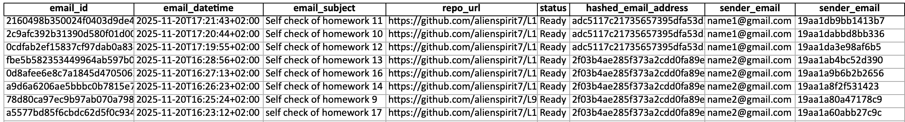
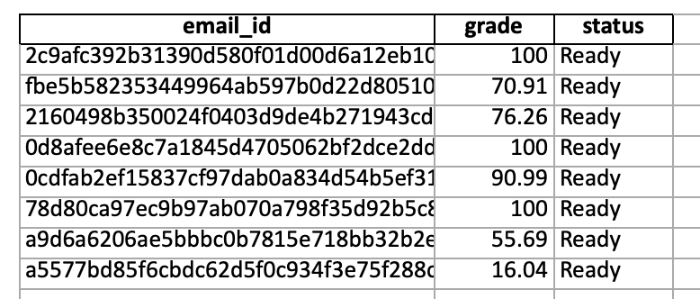
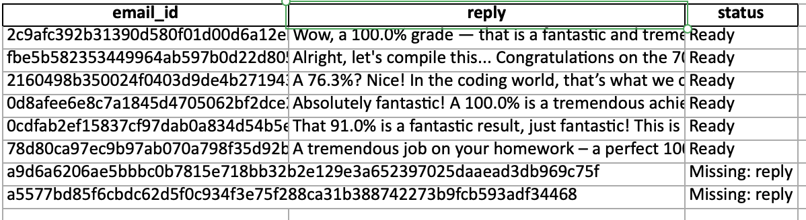

# Homework Grading System

An automated Python package for processing student homework submissions via Gmail, cloning GitHub repositories, analyzing code, generating AI-powered feedback, and creating personalized email draft responses.

## Table of Contents

- [Features](#features)
- [Quick Start](#quick-start)
- [Installation](#installation)
- [Usage](#usage)
- [How It Works](#how-it-works)
- [Program Execution Flow](#program-execution-flow)
- [Handling API Failures & Iterations](#handling-api-failures--iterations)
- [Configuration](#configuration)
- [Project Structure](#project-structure)
- [Troubleshooting](#troubleshooting)
- [Performance](#performance)
- [Security](#security)
- [License](#license)

## Features

- 📧 **Email Processing**: Automatically searches Gmail for homework submissions with pattern matching
- 🔄 **Multi-threaded Cloning**: Parallel repository cloning for improved performance (5 concurrent workers)
- 📊 **Code Analysis**: Analyzes Python files and calculates grades based on line count metrics
- 🤖 **AI Feedback**: Generates personalized feedback using Google's Gemini API with 4 different styles
- ✉️ **Draft Creation**: Creates personalized email drafts with student names
- 📝 **Excel Reports**: Generates detailed Excel files for each processing step
- 🎨 **Interactive Menu**: User-friendly CLI with colored output
- 📋 **Flexible Modes**: Test (1 email), Batch (custom count), and Full (all unread) processing modes
- 🔁 **Retry Logic**: Automatic retry mechanism for Gemini API failures with graceful degradation

## Quick Start

```bash
# Clone repository
git clone <repository-url>
cd L19_HomeWork

# Setup virtual environment
python -m venv venv
source venv/bin/activate  # Windows: venv\Scripts\activate

# Install dependencies
pip install -r requirements.txt

# Configure APIs
cp .env.example .env
# Edit .env with your GEMINI_API_KEY

# Run application
python src/main.py
```

## Installation

### Prerequisites

- Python 3.10 or higher
- Git installed and accessible from command line
- Google Cloud account (for Gmail API)
- Gemini API key from [Google AI Studio](https://makersuite.google.com/app/apikey)

### Step 1: Clone Repository

```bash
git clone <repository-url>
cd L19_HomeWork
```

### Step 2: Create Virtual Environment

```bash
python -m venv venv
source venv/bin/activate  # On Windows: venv\Scripts\activate
```

### Step 3: Install Dependencies

```bash
pip install -r requirements.txt
```

### Step 4: Configure Gmail API

1. Go to [Google Cloud Console](https://console.cloud.google.com/)
2. Create a new project
3. Enable Gmail API
4. Create OAuth 2.0 credentials (Desktop application)
5. Download `credentials.json`
6. Move to `config/` directory:

```bash
mv ~/Downloads/credentials.json config/credentials.json
```

### Step 5: Configure Gemini API

1. Get API key from [Google AI Studio](https://makersuite.google.com/app/apikey)
2. Create `.env` file:

```bash
cp .env.example .env
```

3. Edit `.env` and add your `GEMINI_API_KEY`

### Step 6: Create Student Mapping File

Create `data/students_mapping.xlsx` with the following structure:

| email_address              | name              |
|----------------------------|-------------------|
| student1@example.com       | Alex Johnson      |
| student2@example.com       | Maria Garcia      |

## Usage

### Run the Application

```bash
python src/main.py
```


### Menu Navigation

#### Mode Selection Menu

When you first start the application, you'll be presented with a mode selection menu:


1. **Test Mode** - Process only 1 most recent email (for testing)
2. **Batch Mode** - Process specified number of emails (1-100)
3. **Full Mode** - Process all unread matching emails
4. **Exit** - Quit application

#### Main Menu

After selecting a mode, you'll see the main menu with the following options:


1. **Search Emails** (Step 1) - Search and parse homework submission emails
2. **Clone & Grade Repositories** (Step 2) - Clone repos and calculate grades
3. **Generate Feedback** (Step 3) - Generate AI-powered feedback
4. **Create Email Drafts** (Step 4) - Create personalized draft replies
5. **Run All Steps** - Execute complete workflow (Steps 1-4)
6. **Reset** - Delete all generated files

   

7. **Change Mode** - Return to mode selection
8. **Exit** - Quit application

   

## How It Works

### Step 1: Email Search

- Connects to Gmail API
- Searches for unread emails with subject: "self check of homework XX"
- Extracts metadata (sender, subject, datetime, GitHub URL)
- Generates unique email IDs (SHA-256 hash)
- Creates `file_1_2.xlsx` with email data

**Output Fields:**
- `email_id` (unique SHA-256 hash)
- `email_datetime`
- `email_subject`
- `repo_url`
- `status` ("Ready" or "Missing: [fields]")
- `hashed_email_address`
- `sender_email`
- `thread_id`



### Step 2: Repository Clone & Grade

- Reads `file_1_2.xlsx` (only "Ready" rows)
- Clones repositories in parallel (5 concurrent workers)
- Finds all Python files
- Counts lines (excluding comments and blank lines)
- Calculates grade: `(lines in files >150) / (total lines) × 100`
- Creates `file_2_3.xlsx` with grade data

**Output Fields:**
- `email_id`
- `grade` (0-100)
- `status`



### Step 3: AI Feedback Generation

- Reads `file_2_3.xlsx` (only "Ready" rows)
- Determines feedback style based on grade:
  - **90-100**: Donald Trump style (enthusiastic, superlatives)
  - **70-89**: Shahar Hason style (witty, humorous)
  - **55-69**: Constructive feedback
  - **<55**: Dudi Amsalem style (brash, confrontational, firebrand)
- Calls Gemini API to generate personalized feedback
- **Implements configurable delay between API calls** (default: 60 seconds / 1 minute)
- **Rate limiting:** 60 calls per 60-second window
- Creates `file_3_4.xlsx` with feedback

**Output Fields:**
- `email_id`
- `reply` (generated feedback text, or `None` if API fails)
- `status` ("Ready" or "Missing: reply")

**Important Behavior:**
- **If Gemini API fails:** Reply cell is left **empty** (not a default message)
- Status is set to `"Missing: reply"`
- Rows with status != "Ready" are **automatically excluded** from Step 4
- This ensures only genuine AI feedback proceeds to draft creation
- Failed rows can be reprocessed by running the workflow again



### Step 4: Draft Email Creation

- Reads `file_3_4.xlsx` (only "Ready" rows)
- Joins with `file_1_2.xlsx` to get email metadata
- Loads student names from `students_mapping.xlsx`
- Composes email: "Hi, [name]! [feedback] Your code repository reviewed: [url] Thanks, Koby"
- Creates drafts in Gmail (as replies to original emails)

## Program Execution Flow

### First Run: Processing Initial Batch

When running the complete workflow for the first time, the system processes all available emails:


**First Run Summary:**
- Found 8 unread emails
- Cloned and graded **all 8 repositories** successfully
- Generated feedback for **only 2 students** (Gemini API succeeded)
- **6 feedback generations failed** (Gemini API errors)
- Created **2 email drafts** (only for emails with successful feedback)

The generated drafts appear in Gmail:


**Sample Draft Examples:**


### Unprocessed Emails After First Run

After the first run, some emails remained unread due to Gemini API failures:


**Result:** 6 emails left unprocessed (highlighted in the inbox)

## Handling API Failures & Iterations

### Why Multiple Runs Are Necessary

The Gemini API occasionally fails to provide feedback due to:
- Rate limiting
- Temporary service unavailability
- Network timeouts
- API quota restrictions

The system implements **graceful degradation** with **no fallback text**:
1. **Failed feedback = Empty cell + Status: "Missing: reply"**
2. Rows with status != "Ready" are **excluded from Step 4** (Draft Creation)
3. Emails with failed feedback generation remain **unread**
4. Re-running the workflow processes only the remaining **unread emails**
5. Successfully processed emails are marked as read to avoid reprocessing
6. **No default/fallback feedback is used** - only genuine AI-generated content proceeds

### Second Run: Processing Remaining 6 Emails


**Second Run Summary:**
- Found 6 remaining unread emails
- Processed 6 emails successfully
- Generated feedback for 6 students


The second run generated additional drafts:


**Sample Draft Examples from Second Run:**


**Status After Second Run:**


**Result:** 3 emails still left unprocessed

### Third Run: Processing Final 3 Emails


**Third Run Summary:**
- Found 3 remaining unread emails
- Processed 3 emails successfully
- Generated feedback for 3 students

The final drafts created:


**Sample Draft Examples from Third Run:**


### Final State: All Emails Processed


**Final Summary After 3 Iterations:**
- **Total emails found:** 8 emails initially
- **First run:** 2 drafts created successfully, 6 failed (Gemini API errors in Step 3)
- **Second run:** Processed 6 remaining unread emails, some succeeded
- **Third run:** Processed remaining unread emails until all 8 were complete
- **Total drafts created:** 8 personalized email drafts (one per unique email)
- **Success rate:** 100% after iterative processing (all 8 emails eventually processed)
- **Key insight:** Failed emails remain unread and are automatically reprocessed in subsequent runs
- **Average iterations needed:** ~2-3 runs for complete processing due to Gemini API intermittent failures

### Best Practices for Handling Failures

1. **Monitor the inbox:** Check for unread homework emails after each run
2. **Re-run the workflow:** Simply run "Run All Steps" again to process remaining emails
3. **Check logs:** Review `logs/app.log` for detailed error information
4. **Adjust delays:** The default delay is 60 seconds (1 minute) between API calls. If needed, you can decrease to 30 seconds for faster processing (higher risk of rate limits) or increase to 90-120 seconds for more conservative API usage
5. **Verify API quota:** Check your Gemini API quota in Google AI Studio
6. **Check Excel files:** Open `file_3_4.xlsx` to see which rows have `status = "Missing: reply"`
7. **Understand the behavior:** Empty reply cells mean API failures - these will automatically be retried on next run

## Email Subject Pattern

The system searches for emails with subjects matching this pattern (case-insensitive):

```
self check of homework XX
```

Where XX is a 1-3 digit number. Examples:
- "Self Check of Homework 5" ✓
- "SELF CHECK OF HOMEWORK 42" ✓
- "self check of homework 123" ✓
- "Check of Homework 5" ✗

## GitHub URL Format

Supported repository URL formats:
- `https://github.com/username/repo-name.git`
- `https://github.com/username/repo-name`

## Configuration

### Environment Variables (.env)

```bash
# Gmail API
GMAIL_CREDENTIALS_PATH=config/credentials.json
GMAIL_TOKEN_PATH=config/token.json
GMAIL_ACCOUNT=kobylev@gmail.com

# Gemini API
GEMINI_API_KEY=your_api_key_here

# Application Settings
LOG_LEVEL=INFO
MAX_CLONE_WORKERS=5
CLONE_TIMEOUT=60
GEMINI_REQUEST_DELAY=60

# Processing Limits
MAX_BATCH_SIZE=100
DEFAULT_BATCH_SIZE=10
```

### Key Configuration Parameters

| Parameter | Description | Default | Range | Notes |
|-----------|-------------|---------|-------|-------|
| `MAX_CLONE_WORKERS` | Number of parallel repository clones | 5 | 1-10 | More workers = faster cloning |
| `CLONE_TIMEOUT` | Timeout for git clone operations (seconds) | 60 | 30-300 | Increase for large repos |
| `GEMINI_REQUEST_DELAY` | **Delay between Gemini API requests (seconds)** | **60** | **0-300** | **60 seconds = 1 minute delay between calls** |
| `MAX_BATCH_SIZE` | Maximum emails in batch mode | 100 | 1-1000 | Safety limit |
| `LOG_LEVEL` | Logging verbosity | INFO | DEBUG, INFO, WARNING, ERROR | Use DEBUG for troubleshooting |

**Important Note on `GEMINI_REQUEST_DELAY`:**
- **Default of 60 seconds (1 minute)** provides conservative API usage
- Can decrease to 30 seconds for faster processing (higher risk of rate limits)
- Can increase to 90-120 seconds for more conservative API usage if experiencing failures
- This helps avoid API rate limits and quota exhaustion
- Trade-off: Higher delay = slower processing but fewer failures; Lower delay = faster but more API failures

## Project Structure

```
L19_HomeWork/
├── config/                    # Configuration files
│   ├── __init__.py
│   ├── settings.py           # Settings management
│   └── credentials.json      # Gmail API credentials (not in repo)
│
├── src/
│   ├── __init__.py
│   ├── main.py               # Main application entry point
│   │
│   ├── modules/              # Core processing modules
│   │   ├── __init__.py
│   │   ├── email_processor.py     # Step 1: Email search
│   │   ├── repo_analyzer.py       # Step 2: Clone & grade
│   │   ├── feedback_generator.py  # Step 3: AI feedback
│   │   ├── draft_creator.py       # Step 4: Draft creation
│   │   └── data_manager.py        # Data operations
│   │
│   ├── services/             # External API wrappers
│   │   ├── __init__.py
│   │   ├── gmail_service.py       # Gmail API client
│   │   ├── gemini_service.py      # Gemini API client
│   │   └── git_service.py         # Git operations
│   │
│   └── utils/                # Utilities
│       ├── __init__.py
│       ├── logger.py              # Logging setup
│       ├── validators.py          # Input validation
│       └── hash_utils.py          # Hashing functions
│
├── data/
│   ├── students_mapping.xlsx # Student name mapping (not in repo)
│   └── output/               # Generated Excel files
│       ├── file_1_2.xlsx     # Email data
│       ├── file_2_3.xlsx     # Grade data
│       └── file_3_4.xlsx     # Feedback data
│
├── tmp/                      # Temporary files (not in repo)
│   └── homework_repos/       # Cloned repositories
│
├── logs/                     # Application logs
│   └── app.log
│
├── tests/                    # Test files
│   └── __init__.py
│
├── requirements.txt          # Python dependencies
├── .env                      # Environment variables (not in repo)
├── .env.example              # Environment template
├── .gitignore               # Git ignore rules
├── README.md                # This file
├── PRD.md                   # Product requirements
├── QUICKSTART.md            # Quick start guide
└── CHANGELOG.md             # Version history
```

## Troubleshooting

### Gmail Authentication Fails

**Symptoms:**
- Error: "Failed to connect to Gmail"
- OAuth2 authorization window doesn't open

**Solutions:**
1. Verify `credentials.json` is in `config/` directory
2. Delete `config/token.json` and re-authenticate
3. Check Gmail API is enabled in Google Cloud Console
4. Verify OAuth consent screen is configured
5. Ensure correct scopes are set (gmail.readonly, gmail.compose, gmail.modify)

### No Emails Found

**Symptoms:**
- "No matching emails found" message
- Email search returns 0 results

**Solutions:**
1. Check emails are unread in Gmail
2. Verify subject matches pattern exactly: "self check of homework XX"
3. Test with exact subject in Gmail search bar
4. Check Gmail account in `.env` matches the authenticated account
5. Verify email contains a GitHub repository URL

### Repository Clone Fails

**Symptoms:**
- "Failed to clone repository" error
- Timeout during clone operation

**Solutions:**
1. Verify Git is installed: `git --version`
2. Check repository URL is public (not private)
3. Increase `CLONE_TIMEOUT` in `.env` (try 120 seconds)
4. Check network connectivity
5. Verify URL format is correct
6. Try cloning manually: `git clone <url>`

### Gemini API Errors

**Symptoms:**
- "Feedback generation failed" messages
- Emails remain unread after processing
- API timeout or rate limit errors
- Many rows in `file_3_4.xlsx` with `status = "Missing: reply"`
- Empty `reply` cells in Excel file

**Solutions:**
1. Verify `GEMINI_API_KEY` is valid and correctly set in `.env`
2. Check API quota hasn't been exceeded in [Google AI Studio](https://makersuite.google.com/)
3. **Adjust `GEMINI_REQUEST_DELAY` in `.env` if needed**
   ```bash
   # In .env file
   GEMINI_REQUEST_DELAY=60  # Default: 60 seconds (1 minute)
   # Decrease to 30 for faster (but riskier) processing
   # Increase to 90-120 for more conservative API usage
   ```
4. **Re-run the workflow** - the system will automatically process remaining emails
5. Check logs for specific error messages: `logs/app.log`
6. Try test mode first to verify API is working

**Understanding the Behavior:**
- When Gemini fails: `reply` cell is **empty** and `status = "Missing: reply"`
- **No fallback text is used** to maintain data quality
- Rows with empty replies are **automatically skipped** in Step 4 (Draft Creation)
- Simply re-run to retry failed feedback generation

### Drafts Not Created

**Symptoms:**
- "Failed to create draft" error
- Drafts don't appear in Gmail

**Solutions:**
1. Verify Gmail API has compose permissions
2. Check `students_mapping.xlsx` exists and is properly formatted
3. Ensure thread_id exists in `file_1_2.xlsx`
4. Check Gmail drafts folder (may be in different language)
5. Review logs for specific error messages

### Performance Issues

**Symptoms:**
- Slow repository cloning
- Long processing times

**Solutions:**
1. Reduce `MAX_CLONE_WORKERS` if system is overloaded
2. Increase `CLONE_TIMEOUT` for large repositories
3. Use Test or Batch mode instead of Full mode
4. Check disk space in `tmp/` directory
5. Verify network bandwidth is sufficient

## Logging

Logs are stored in the `logs/` directory:
- `app.log` - General application logs with timestamps
- Rotates automatically when file size exceeds limit

### Log Levels

Set log level in `.env`:

```bash
LOG_LEVEL=DEBUG  # DEBUG, INFO, WARNING, ERROR, CRITICAL
```

**DEBUG**: Detailed information for diagnosing problems
**INFO**: General information about program execution (default)
**WARNING**: Warning messages about potential issues
**ERROR**: Error messages for serious problems
**CRITICAL**: Critical errors that may cause program failure

### Viewing Logs

```bash
# View recent logs
tail -f logs/app.log

# View last 100 lines
tail -n 100 logs/app.log

# Search for errors
grep ERROR logs/app.log

# Search for specific email
grep "email_id" logs/app.log
```

## Performance

### Typical Processing Times

**Test Mode (1 email):**
- Email search: <2 seconds
- Repository cloning: ~5-10 seconds
- Grade calculation: <2 seconds
- Feedback generation: ~3-5 seconds
- Draft creation: <2 seconds
- **Total: ~15-20 seconds**

**Batch Mode (10 emails):**
- Email search: <5 seconds
- Repository cloning: ~30-45 seconds (parallel, 5 workers)
- Grade calculation: ~10-20 seconds
- Feedback generation: ~20-30 seconds
- Draft creation: ~10-20 seconds
- **Total: ~2-3 minutes**

**Full Mode (50 emails):**
- Email search: <10 seconds
- Repository cloning: ~3-5 minutes (parallel, 5 workers)
- Grade calculation: ~1-2 minutes
- Feedback generation: ~2-3 minutes
- Draft creation: ~1-2 minutes
- **Total: ~8-12 minutes**

### Performance Optimization Tips

1. **Increase parallel workers**: Set `MAX_CLONE_WORKERS=10` for faster cloning (if system allows)
2. **Use SSD storage**: Store `tmp/` directory on SSD for faster git operations
3. **Reduce delays**: Lower `GEMINI_REQUEST_DELAY` if not rate-limited
4. **Batch processing**: Process emails in smaller batches for better control
5. **Network optimization**: Use wired connection for faster cloning

## Security

### Data Protection

- **Email addresses hashed**: All email addresses are hashed using SHA-256 in output files
- **OAuth2 authentication**: Secure Gmail authentication using OAuth 2.0
- **API keys protected**: API keys stored in `.env` (not committed to version control)
- **Credentials excluded**: `.gitignore` configured to exclude all sensitive files

### Files Not Committed to Git

```
.env                      # API keys and configuration
config/credentials.json   # Gmail OAuth credentials
config/token.json        # Gmail OAuth token
data/students_mapping.xlsx # Student personal information
data/output/*.xlsx       # Processing results with hashed emails
tmp/                     # Cloned repositories
logs/                    # Application logs
```

### Best Practices

1. **Never share credentials**: Keep `credentials.json` and `.env` private
2. **Rotate API keys**: Regularly rotate Gemini API keys
3. **Limit permissions**: Use minimum required Gmail API scopes
4. **Secure storage**: Store student mapping file securely
5. **Regular audits**: Review logs for unauthorized access attempts

## License

MIT License

Copyright (c) 2025 Homework Grading System

Permission is hereby granted, free of charge, to any person obtaining a copy
of this software and associated documentation files (the "Software"), to deal
in the Software without restriction, including without limitation the rights
to use, copy, modify, merge, publish, distribute, sublicense, and/or sell
copies of the Software, and to permit persons to whom the Software is
furnished to do so, subject to the following conditions:

The above copyright notice and this permission notice shall be included in all
copies or substantial portions of the Software.

THE SOFTWARE IS PROVIDED "AS IS", WITHOUT WARRANTY OF ANY KIND, EXPRESS OR
IMPLIED, INCLUDING BUT NOT LIMITED TO THE WARRANTIES OF MERCHANTABILITY,
FITNESS FOR A PARTICULAR PURPOSE AND NONINFRINGEMENT. IN NO EVENT SHALL THE
AUTHORS OR COPYRIGHT HOLDERS BE LIABLE FOR ANY CLAIM, DAMAGES OR OTHER
LIABILITY, WHETHER IN AN ACTION OF CONTRACT, TORT OR OTHERWISE, ARISING FROM,
OUT OF OR IN CONNECTION WITH THE SOFTWARE OR THE USE OR OTHER DEALINGS IN THE
SOFTWARE.

## Author

Created for Koby homework grading automation.

## Support

For issues and questions:

1. **Check logs**: Review `logs/app.log` for detailed error information
2. **Enable debug mode**: Set `LOG_LEVEL=DEBUG` in `.env` for verbose logging
3. **Review troubleshooting**: Check the [Troubleshooting](#troubleshooting) section
4. **Re-run workflow**: Many issues (especially Gemini API failures) resolve by re-running
5. **Check quotas**: Verify API quotas in Google Cloud Console and Google AI Studio
6. **Contact administrator**: Reach out to the system administrator for persistent issues

## Contributing

Contributions are welcome! Please follow these guidelines:

1. Fork the repository
2. Create a feature branch: `git checkout -b feature-name`
3. Make your changes with clear commit messages
4. Add tests for new functionality
5. Update documentation as needed
6. Submit a pull request with a clear description

## Acknowledgments

- **Google Gmail API**: Email processing and draft creation
- **Google Gemini API**: AI-powered feedback generation
- **Python Community**: Excellent libraries and tools
- **Students**: For their patience during system testing
